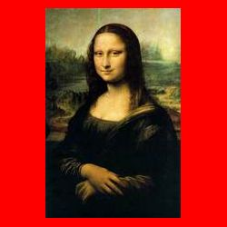
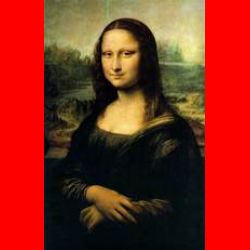
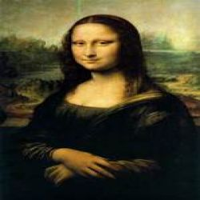
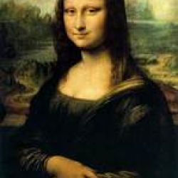
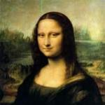

# Gregwar's Image class

[](https://travis-ci.org/Gregwar/Image)
[](https://www.paypal.com/cgi-bin/webscr?cmd=_s-xclick&hosted_button_id=YUXRLWHQSWS6L)

The `Gregwar\Image` class purpose is to provide a simple object-oriented images handling and caching API.

# Installation

With composer :

``` json
{
    ...
    "require": {
        "gregwar/image": "2.*"
    }
}
```

# Usage

## Basic handling

Using methods chaining, you can open, transform and save a file in a single line:

```php
<?php use Gregwar\Image\Image;

Image::open('in.png')
     ->resize(100, 100)
     ->negate()
     ->save('out.jpg');
```

Here are the resize methods:

* `resize($width, $height, $background)`: resizes the image, will preserve scale and never
   enlarge it (background is `red` in order to understand what happens):



* `scaleResize($width, $height, $background)`: resizes the image, will preserve scale, can enlarge
 it (background is `red` in order to understand what happens):



* `forceResize($width, $height, $background)`: resizes the image forcing it to
   be exactly `$width` by `$height`



* `cropResize($width, $height, $background)`: resizes the image preserving scale (just like `resize()`)
  and croping the whitespaces:


* `zoomCrop($width, $height, $background, $xPos, $yPos)`: resize and crop the image to fit to given dimensions:



* In `zoomCrop()`, You can change the position of the resized image using the `$xPos` (center, left or right) and `$yPos` (center,
  top or bottom):



The other methods available are:

* `crop($x, $y, $w, $h)`: crops the image to a box located on coordinates $x,y and
   which size is $w by $h

* `negate()`: negates the image colors

* `brighness($b)`: applies a brightness effect to the image (from -255 to +255)

* `contrast($c)`: applies a contrast effect to the image (from -100 to +100)

* `grayscale()`: converts the image to grayscale

* `emboss()`: emboss the image

* `smooth($p)`: smooth the image

* `sharp()`: applies a mean removal filter on the image

* `edge()`: applies an edge effect on the image

* `colorize($red, $green, $blue)`: colorize the image (from -255 to +255 for each color)

* `sepia()`: applies a sepia effect

* `merge($image, $x, $y, $width, $height)`: merges two images

* `fill($color, $x, $y)`: fills the image with the given color

* `write($font, $text, $x, $y, $size, $angle, $color, $position)`: writes text over image, $position can be any of 'left', 'right', or 'center'

* `rectangle($x1, $y1, $x2, $y2, $color, $filled=false)`: draws a rectangle

* `rotate($angle, $background = 0xffffff)` : rotate the image to given angle

* `roundedRectangle($x1, $y1, $x2, $y2, $radius, $color, $filled=false)`: draws a rounded rectangle ($radius can be anything from 0)

* `line($x1, $y1, $x2, $y2, $color)`: draws a line

* `ellipse($cx, $cy, $width, $height, $color, $filled=false)`: draws an ellipse

* `circle($cx, $cy, $r, $color, $filled=false)`: draws a circle

* `fillBackground($bg=0xffffff)`: fills the background of a transparent image to the 'bg' color

* `fixOrientation()`: return the image rotated and flipped using image exif information 

* `applyExifOrientation(int $exif_rotation_value)`: return the image rotated and flipped using an exif rotation value 

* `html($title = '', $type = 'jpg')`: return the `` tag with the cache image

* `flip($flipVertical, $flipHorizontal)`: flips the image in the given directions. Both params are boolean and at least one must be true.

* `inline($type = 'jpg')`: returns the HTML inlinable base64 string (see `demo/inline.php`)

You can also create image from scratch using:

```php
<?php
    Image::create(200, 100);
```

Where 200 is the width and 100 the height

## Saving the image

You can save the image to an explicit file using `save($file, $type = 'jpg', $quality = 80)`:

```php
<?php
    // ...
    $image->save('output.jpg', 'jpg', 85);
```

You can also get the contents of the image using `get($type = 'jpg', $quality = 80)`, which will return the binary contents of the image

## Using cache

Each operation above is not actually applied on the opened image, but added in an operations
array. This operation array, the name, type and modification time of file are hashed using
`sha1()` and the hash is used to look up for a cache file.

Once the cache directory configured, you can call the following methods:

* `jpeg($quality = 80)`: lookup or create a jpeg cache file on-the-fly

* `gif()`: lookup or create a gif cache file on-the-fly

* `png()`: lookup or create a png cache file on-the-fly

* `guess($quality = 80)`: guesses the type (use the same as input) and lookup or create a
  cache file on-the-fly

* `setPrettyName($prettyName, $prefix = true)`: sets a "pretty" name suffix for the file, if you want it to be more SEO-friendly.
   for instance, if you call it "Fancy Image", the cache will look like something/something-fancy-image.jpg.
   If `$prefix` is passed to `false` (default `true`), the pretty name won't have any hash prefix.
   If you want to use non-latin1 pretty names, **behat/transliterator** package must be installed.

For instance:

```php
<?php use Gregwar\Image\Image;

echo Image::open('test.png')
          ->sepia()
          ->jpeg();

//Outputs: cache/images/1/8/6/9/c/86e4532dbd9c073075ef08e9751fc9bc0f4.jpg
```

If the original file and operations do not change, the hashed value will be the same and the
cache will not be generated again.

You can use this directly in an HTML document:


```php
<?php use Gregwar\Image\Image;

// ...
resize(150, 150)->jpeg(); ?>" />
// ...
```

This is powerful since if you change the original image or any of your code the cached hash
will change and the file will be regenerated.

Writing image
-------------

You can also create your own image on-the-fly using drawing functions:


```php
<?php 
    $img_src = Image::create(300, 300)
                    ->fill(0xffaaaa)    // Filling with a light red
                    ->rectangle(0xff3333, 0, 100, 300, 200, true) // Drawing a red rectangle
                      // Writing "Hello $username !" on the picture using a custom TTF font file
                    ->write('./fonts/CaviarDreams.ttf', 'Hello '.$username.'!', 150, 150, 20, 0, 'white', 'center')
                    ->jpeg();
?>
" />
```

## Using fallback image

If the image file doesn't exists, you can configurate a fallback image that will be used
by the class (note that this require the cache directory to be available).

A default "error" image which is used is in `images/error.jpg`, you can change it with:

```php
<?php
    $img->setFallback('/path/to/my/fallback.jpg');
```

## Garbage Collect

To prevent the cache from growing forever, you can use the provided GarbageCollect class as below:

```php
<?php use Gregwar\Image\GarbageCollect;

// This could be a cron called each day @3:00AM for instance
// Removes all the files from ../cache that are more than 30 days
// old. A verbose output will explain which files are deleted
GarbageCollect::dropOldFiles(__DIR__.'/../cache', 30, true);

```

# Development

`Gregwar\Image` is using PHP metaprogramming paradigms that makes it easy to enhance.

Each function that handles the image is implemented in an *Adapter*, this is where
all the specific actions take place.

The `Common` adapter is design to contain common abstract actions, while the
specific adapters (like `GD`) are designed to contain actions specific to the low
level layer.

You can add your own methods by adding it in the corresponding adapter.

```php
<?php
    // In the adapter
    private function myFilter()
    {
        $this->negate();
        $this->sepia();
    }
```

Which could be used on the Image

```php
<?php
    $image->myFilter();
```

You can also write your own adapter which could extend one of this repository and use it by calling `setAdapter()`:

```php
<?php
    $image->setAdapter(new MyCustomAdapter);
```

# License

`Gregwar\Image` is under MIT License, please read the LICENSE file for further details.
Do not hesitate to fork this repository and customize it !
